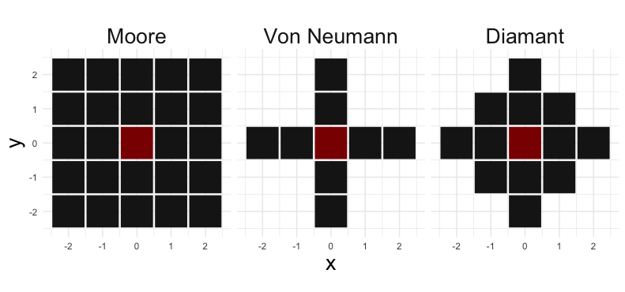

# Neighbour Apply

*Tobias Krause, 2018*

*Find the entire project description in nhapply.pdf. Only german.*

## The Idea behind Neighbour Apply

A common task when building cellular automata, pixel-simulations or similar is to apply a function on the neighbourhood of a pixel. It can be tireding, implementing such functions, so that they are efficient and flexible.

The packages' main function **nhapply**  processes pixel-neighbourhoods significantly faster than for-loops and is as easy to use as sapply. At the same time it maintains great flexibility in defining neighbourhoods and custom functions.

## How to use nhapply

nhapply works like the apply family; input is a matrix, FUN is the function to apply on the neighbourhood of each pixel. 

### Possible Modes of Input for FUN
* optimised: ```nhapply(input_matrix, "max")```
* base: ```nhapply(input_matrix, max)```
* customised: ```nhapply(input_matrix, function(x) max(x))```

*optimised functions are: "mean", "sum", "max", "min", "which.max", "which.min", "maxcount", "maxcountvalue"; check documentation for more details*

### Modification of Neighbourhoods
* **neighb_type:** The three types of default neighbourhoods are: 1..."Moore", 2..."VonNeumann", 3..."Diamond". 
* **width:** specifies the width of the default neigbourhood.
* **custom_neighb:** give the x-y-coordinates as columns, that describe the positions of the neighbours relatively to the center or give a matrix with 1's at the neighbours position and 0's at the rest.
* ```nhapply(input_matrix, "maxcountvalue", neighb_type = 2, width = 3)```
* ```nhapply(input_matrix, sum, custom_neighb = cbind(c(1, 1, -1, -1), c(1, -1, 1, -1)))```



## Example: Conways Game of Life

```
game_field <- matrix(sample(0:1, 100 * 100, rep = TRUE, prob = c(7, 3)), nrow = 100)

i <- 1
while (i < 10){
  # apply function to neighbours
  sum_neighbours <- nhapply(game_field, sum)
  
  # game-variation:
  # sum_neighbours <- nhapply(game_field, sum,
  # neighb_type = "diamond", width = 2)
  
  # process result
  game_field[sum_neighbours < 2 || sum_neighbours > 3] <- 0
  game_field[sum_neighbours == 3] <- 1
  
  # plotting
  par(pty = "s")
  plot(col(game_field), rev(row(game_field)), col = game_field,
       pch = 15, yaxt="n", xaxt="n", ylab="", xlab="",
       main = paste("Conways Game of life frame", i))
  i <- i+1
}
```


